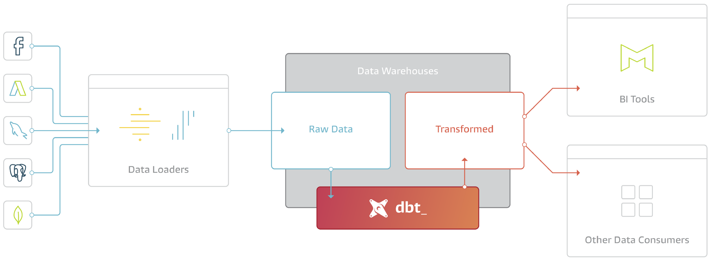

# BetterUp Analytics

> Data Warehouse ELT (the T of our Extract-Load-Transform process)

## Data Infrastructure overview



_(image [source](https://blog.fishtownanalytics.com/what-exactly-is-dbt-47ba57309068))_

## Setup [DBT](https://docs.getdbt.com/)

The following steps only need to be done once
when setting up for the first time.

### Getting access to Snowflake

To be able to run **DBT**, you will need access to Snowflake.
Request Snowflake app via Okta as described
[here](https://betterup.atlassian.net/wiki/spaces/ET/pages/11239994/Accounts+and+Services).
Create a
[INFOSEC ticket](https://betterup.atlassian.net/jira/core/projects/INFOSEC/board)
and assigned to your manager for approval. Once approved assign to one of
the admins from this [list under Snowflake](https://betterup.atlassian.net/wiki/spaces/ET/pages/11239994/Accounts+and+Services).

### Installing Python via brew

Instructions are based on this [document](https://docs.python-guide.org/starting/install3/osx/).

In your terminal, run:
- `$ /bin/bash -c "$(curl -fsSL https://raw.githubusercontent.com/Homebrew/install/master/install.sh)"
` 
- `export PATH="/usr/local/opt/python/libexec/bin:$PATH"`
- `brew install python`

### Clone betterup-analytics repo

With `cd <path to local directory>` change the current working
directory to the location where you want the `betterup-analytics`
repo to be created, and run:

```bash
git clone https://github.com/betterup/betterup-analytics.git
```
Note:
- GitHub has deprecated password based authentication.
You’ll need to create a
[Personal Access Token](https://docs.github.com/en/authentication/keeping-your-account-and-data-secure/creating-a-personal-access-token)
with the proper scopes and
[Configure SSO](https://docs.github.com/en/enterprise-cloud@latest/authentication/authenticating-with-saml-single-sign-on/authorizing-a-personal-access-token-for-use-with-saml-single-sign-on)
to the BetterUp organization.

- Copy the newly created token and use it as your password
when prompted.

- If an error message occurs, check if there is a link within
the error message and use it to authenticate.

### Configure setup.yml

- Navigate to `betterup-analytics/warehouse` subdirectory with
`cd <path to warehouse subdirectory>`
- Run `mkdir ~/.dbt` this will create a hidden **.dbt** folder
in your home directory
- Run `cp ./warehouse/setup.profiles.yml ~/.dbt/profiles.yml`
this will copy and paste the **profiles.yml** into your **~/.dbt** folder
- Run `nano ~/.dbt/profiles.yml` to edit the file
- Replace the following environment variables in the **dev** section but leave the other environment sections as they are
(Note: we use browser-based SSO for authentication):
  - `user: <your_snowflake_username>`
  - `schema: dbt_<your_name>`

Example:

```commandline
betterup-analytics:
  outputs:
    dev:
        type: snowflake
        account: oj02423.us-east-1
        user: KAROLINA.WYPISNIAK@BETTERUP.CO
        # enables SSO auth
        authenticator: externalbrowser
        database: dev_analytics
        role: transformer
        warehouse: transforming
        schema: dbt_karo
        threads: 4
        client_session_keep_alive: False
```

### Install [DBT](https://www.getdbt.com/) using `poetry`

(alternatively you can also use **pipenv** with the **Pipfile** to install DBT)

- In your terminal cd into the warehouse directory `cd warehouse`
- Install poetry `make installpoetry`
- Install poetry dependencies `make installdeps`
- Run `nano ~/.zprofile` to open up your shell configuration file in an editor (or use a terminal text editor of choice to edit `~/.zprofile`)
- Add `export PATH="/Users/<your_username>/.local/bin:$PATH"` to the beginning of your file
and save the changes with Control+O, then exit with Control+X (the correct PATH with your username should be visible in your terminal
after you ran `make installdeps`)
- Run `source ~/.zprofile` to activate your new configurations
- Activate virtualenv `make activate` or `poetry shell`
- Check if dbt is installed with `dbt --version`

### Run DBT
- In your terminal navigate to your `betterup-analytics/warehouse` repo
- Run `dbt clean` to delete folders specified in the clean-targets list in **dbt_project.yml**
- Run `dbt deps` to install additional packages
- Run `dbt seed` to create tables from managed CSV files
- Run `dbt run --exclude models/betterup_eu/` to run all models against your dev target
  - This step will take a while to complete
  - It will create views/tables in DBT_[USERNAME]
  schema of the DEV_ANALYTICS database within Snowflake
- Run `dbt compile` to generate executable SQL from all your models

## Developing in dbt

- Navigate to `betterup-analytics/warehouse`
- Make sure you are on the main branch `git checkout main`
- Pull most recent changes from remote with `git pull origin main`
- Create new local branch and switch to it with `git checkout -b DATA-xxxx`
- Activate your virtualenv with `poetry shell`
- Make changes to your models as necessary
- Run `dbt run --select @my_changed_sql_file` to create models against
your dev environment (you can see the tables/views in Snowflake under
DEV_ANALYTICS.DBT_<myname>.a_view)
- Stage changes with `git add *` and commit changes
with `git commit -m "describe your changes here"`
- Push your changes to remote with `git push origin DATA-xxxx`
- Create a Pull Request (PR) in [GitHub](https://github.com/betterup/betterup-analytics)
and once approved merge changes

Please read through our [Data Best Practices and Guidelines](https://betterup.atlassian.net/wiki/spaces/DATA/pages/2899968085/Data+Modeling+Center+of+Excellence)
before starting to develop with dbt.

## Testing code via DataDiff

[Loom Video showcasing DataDiff Example](https://www.loom.com/share/7a4175723afc46329afa5ab2db1226ab)

[DataDiff Documentation](https://docs.datafold.com/)

DataDiff lets you test your dev **data** against prod **data**. That way you can see if your code has potentially
unintended downstream implications. See [DataDiff Demo Video](https://youtu.be/nJNWMDl5V9A) for more explanation.

To test your code via DataDiff you first need to install it by running in your terminal:
```
pip install --upgrade pip
pip install data-diff 'data-diff[snowflake]' -U`
```` 

### How to use DataDiff

- I made changes to `stg_coach__coach_profiles` in dbt and want to check that data against prod data:
```
dbt run -m stg_coach__coach_profiles && data-diff --dbt --no-tracking
```

- I made changes to `stg_coach__coach_profiles` in dbt and want to check all downstream data against prod data:
```
dbt run -m stg_coach__coach_profiles+ && data-diff --dbt --no-tracking
```

- I made changes to `stg_coach__coach_profiles` in dbt and want to check the data of the downstream data model `coach_comp__sessions` against its prod data
(because testing all downstream models takes too long):

Two commands:
```
dbt run -m stg_coach__coach_profiles+
data-diff --dbt -s coach_comp__sessions --no-tracking
```

- I made changes to `stg_coach__coach_profiles` in dbt and want to check that data against prod data but
only for data in a specific daterange because otherwise it takes too long and/or I want to exclude today's day:

Add to the `stg_coach__coach_profiles.yml` file a filter:
```
models:
  - name: stg_coach__coach_profiles
    meta:
      datafold:
        datadiff:
          filter: "created_at <= current_date() - 1"
```

More advanced DataDiff commands can be found in [this DataDiff guide](https://docs.datafold.com/guides/dbt_advanced_configs).

## Testing code in a staging environment

If you would like to test your code in a production like environment, you can use the
`stg_analytics` database in Snowflake. Currently, this is only done for code changes that
are beyond the usual data model development, like dbt upgrades or changes to schema names in 
the `get_custom_schema_name.sql` macro.

For this you would first need to add your personal user email address
in your `~/.dbt/profiles.yml` file under the `stg` profile, similar to this:

```commandline
betterup-analytics:
  outputs:
    stg:
        type: snowflake
        account: oj02423.us-east-1
        user: KAROLINA.WYPISNIAK@BETTERUP.CO
        # enables SSO auth
        authenticator: externalbrowser
        database: stg_analytics
        role: transformer
        warehouse: transforming
        schema: analytics
        threads: 4
        client_session_keep_alive: False
```

You can then run in your command line `dbt run --exclude models/betterup_eu/ --target stg`
to create all data models in the `stg_analytics` database. 

## Upgrading DBT

## Upgrading DBT with Poetry using Codespace

### Test Upgrade Locally

DBT needs to be upgraded regularly to newer versions. You can check your
current DBT version by running `dbt --version` in your terminal.
It will tell you if you are running DBT on the latest version.
Here you can find in the [DBT Migration Guides](https://docs.getdbt.com/docs/guides/migration-guide).
If you want to upgrade DBT, follow the subsequent steps:

- Navigate to the `betterup-analytics` repo
- Create a new branch for the dbt upgrade (make sure you pull most recent changes beforehand)
- Create a Codespace with VScode
  - You need to make sure you are opening up VScode on you machine (in Github under `Code` click the `...` then `Open in ...`, then `Open in Visual 
  Studio Code`) 
  
  

  - You would need to have VScode installed on your machine 
  - You may need to adjust permissions to VScode on your machine as described [here](https://support.apple.com/guide/mac-help/if-you-need-permission-to-open-an-item-on-mac-mchlp1038/mac#:~:text=If%20you%20don't%20have,Permissions%20to%20expand%20the%20section)
  - You may want to adjust the "default idle timeout" to 240 min in your [Github Codespace Settings](https://github.com/settings/codespaces)
- Once VScode is running change working directory to `/warehouse`
- Run `poetry install`
- Activate your virtualenv with `poetry shell`
- Run `dbt --version` to check the current dbt version
- Update in the `pyproject.toml` file the `dbt-core` and `dbt-snowflake` values to the desired version
- Run `poetry lock` to generate new lock file
- Check the dbt version with `dbt --version` (it should reflect the new version you indicated in the `pyproject.toml` file)
- Add, commit, and push those changes and create a draft PR
- If there are any breaking changes for the upgrade, address them and verify that dbt is running
- You should run all data models with `dbt deps`, `dbt seed`, `dbt snapshot`, `dbt run`, `dbt test` and make sure you have no errors
- Add, commit, and push those changes
- Tag DataOps, Analytics Engineering and PAD on the PR and get approval from each group
- Communicate upgrade in the Data-Guild Slack channel

### Cross Validating views/tables from `DBT_V1.x.x_upgrade`

In Snowflake run SQL similar to this:

```commandline
SELECT *
FROM "ANALYTICS"."DBT_V1.x.x_UPGRADE"."DIM_MEMBERS"
WHERE created at < '2023-01-01'

MINUS

SELECT *
FROM "ANALYTICS"."CORE"."DIM_MEMBERS"
WHERE created at < '2023-01-01';
```

Try to cover several views/tables that are of particularly importance.

### DBT ownership 

The `meta` field is used to set metadata for a resource. This metadata is compiled into the `manifest.json` file generated by dbt, and is viewable in the auto-generated documentation. 

There are 2 types of owners that can be defined in `meta` field, 
1. `team_owner` refers to the group that owns the model and is REQUIRED. This field must be set to one of the teams defined in `warehouse/dbt_recipe.dhub.yaml`. 
2. `owner` refers to an indivdual owner of a model. This should set to a BetterUp email. 
The `meta_mapping` feature in `dbt_recipe.dhub.yaml` maps the metadata to ownership in Acryl. 

**Note** that only one team/individual can be assigned for each field as the `meta` field is a dictionary and the `meta_mapping` feature cannot parse lists.

There are 2 ways to configure the metadata:
1. Configuring directories of models in `dbt_project.yml`
The metadata defined here will be inherited by models in the directory. 
```
models:
  dbt_project_evaluator:
    +schema: dbt_project_evaluator

  warehouse:
    +enabled: true
    +materialized: view
    +post-hook:
      - '{{ grant_access() }}'
    +meta: 
      team_owner: "analytics_eng_group"
```
    
2. Configure `schema.yml` for each model
This apply the metadata to that specific model. Note that metadata configured here will overwrite the metadata defined in the `dbt_project.yml` if the keys are the same. 

In the example below, `team_owner` would be `data_ops_group` rather than the `analytics_eng_group`
```
models:
  - name: name_of_model
    meta:
      team_owner: "data_ops_group"
      owner: "rui.xie@betterup.co"
```

### Enforcing Ownership 
To test ownership locally, simply run `dbt run -m stg_nodes` first, and then `dbt test --select test__model_meta_owner`


## DBT Style Guides and Best Practices

Here is some documentation from DBT about [Best Practices](https://docs.getdbt.com/docs/guides/best-practices)
and a [Style Guide](https://github.com/dbt-labs/corp/blob/main/dbt_style_guide.md).

## Coding Helper Tools
[dbt-codegen](https://github.com/dbt-labs/dbt-codegen) can be used to generate dbt code for source yamls, base sql models, and model yamls. 

You can run dbt-codegen commands in dbt and the code will output in the terminal window.  You can then copy and paste this code into a file.

Examples:
- Generate source yml - 
```dbt run-operation generate_source --args '{"schema_name": "jaffle_shop", "database_name": "raw"}'```
- Generate base model - 
```dbt run-operation generate_base_model --args '{"source_name": "raw_jaffle_shop", "table_name": "customers"}'```
- Generate model yml - 
```dbt run-operation generate_model_yaml --args '{"model_name": "customers"}'```
  
[dbt_unittest](https://github.com/yu-iskw/dbt-unittest) can be used to unit test macros.
  
You define the assertion test(s) in a macro then run them using **dbt run-operation name_of_macro**. If the assertion fails an error is returned, if the assertion passes nothing is returned.

[Tutorial](https://docs.google.com/presentation/d/17hgK-KV-5zNdmI3HlTgNUSivvTR2AHg7BjT34eo_ABU/edit#slide=id.g249d58d0a6c_0_4)
  
[Example Usage](https://github.com/betterup/betterup-analytics/blob/main/warehouse/macros/unit_tests/convert_airbyte_sfdc_name_to_segment_sfdc_name_unit_tests.sql)
  

## Get Started Using CodeSpaces

Local dev setup broken?  Just want to get started with something that works?  Following these quick simple instructions to get started!

1. Have VSCode installed on your laptop
2. Set the following environmental variables on your [github codespace preference page](https://github.com/settings/codespaces)
  a. `SNOWFLAKE_SCHEMA` - custom prefix for your dbt space.  example: davidleung
  b. `SNOWFLAKE_USER` - this is typically your betterup.co email address assuming your snowflake account was okta provisioned. example: david.leung@betterup.co
3. Click the code button on main betterup-analytics page and select create from main or use this [direct link](https://github.com/codespaces/new?hide_repo_select=true&ref=main&repo=123953826) for custom options 
4. Once within the codespace run the following commands to get started
```
# go to the warehouse directory
cd warehouse

# activate poetry / python virtual env 
poetry shell

# run some dbt commands!
#
# Note: dbt commands that require authentication to snowflake will have a popup 
# to external browser window to authenticate via SSO
#
dbt seed
dbt run
```


